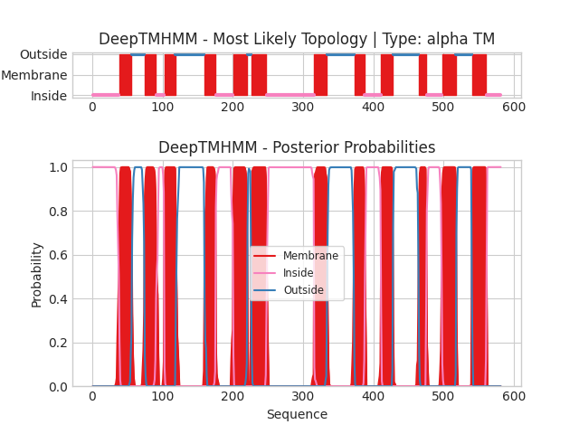

## DeepTMHMM - Predictions
Predicted topologies can be downloaded in [.gff3 format](TMRs.gff3) and [.3line format](predicted_topologies.3line)

You can download the probabilities used to generate this plot [here](sequence_probs.csv)
### Predicted Topologies
```
>sequence | TM
MPAPRAREQPRVPGERQPLLPRGARGPRRWRRAAGAAVLLVEMLERAAFFGVTANLVLYLNSTNFNWTGEQATRAALVFLGASYLLAPVGGWLADVYLGRYRAVALSLLLYLAASGLLPATAFPDGRSSFCGEMPASPLGPACPSAGCPRSSPSPYCAPVLYAGLLLLGLAASSVRSNLTSFGADQVMDLGRDATRRFFNWFYWSINLGAVLSLLVVAFIQQNISFLLGYSIPVGCVGLAFFIFLFATPVFITKPPMGSQVSSMLKLALQNCCPQLWQRHSARDRQCARVLADERSPQPGASPQEDIANFQVLVKILPVMVTLVPYWMVYFQMQSTYVLQGLHLHIPNIFPANPANISVALRAQGSSYTIPEAWLLLANVVVVLILVPLKDRLIDPLLLRCKLLPSALQKMALGMFFGFTSVIVAGVLEMERLHYIHHNETVSQQIGEVLYNAAPLSIWWQIPQYLLIGISEIFASIPGLEFAYSEAPRSMQGAIMGIFFCLSGVGSLLGSSLVALLSLPGGWLHCPKDFGNINNCRMDLYFFLLAGIQAVTALLFVWIAGRYERASQGPASHSRFSRDRG
IIIIIIIIIIIIIIIIIIIIIIIIIIIIIIIIIIIIIIMMMMMMMMMMMMMMMMMMOOOOOOOOOOOOOOOOOOMMMMMMMMMMMMMMMMIIIIIIIIIIIIMMMMMMMMMMMMMMMMOOOOOOOOOOOOOOOOOOOOOOOOOOOOOOOOOOOOOOOOOMMMMMMMMMMMMMMMMIIIIIIIIIIIIIIIIIIIIIIIIIMMMMMMMMMMMMMMMMMMMMOOOOOOMMMMMMMMMMMMMMMMMMMMMIIIIIIIIIIIIIIIIIIIIIIIIIIIIIIIIIIIIIIIIIIIIIIIIIIIIIIIIIIIIIIIIIIIIMMMMMMMMMMMMMMMMMMMOOOOOOOOOOOOOOOOOOOOOOOOOOOOOOOOOOOOOOMMMMMMMMMMMMMMMIIIIIIIIIIIIIIIIIIIIIIIMMMMMMMMMMMMMMMMMOOOOOOOOOOOOOOOOOOOOOOOOOOOOOOOOOOOOOMMMMMMMMMMMIIIIIIIIIIIIIIIIIIIIIIMMMMMMMMMMMMMMMMMMMMOOOOOOOOOOOOOOOOOOOOOOMMMMMMMMMMMMMMMMMMMMMIIIIIIIIIIIIIIIIIIIII

```


```
##gff-version 3
# sequence Length: 581
# sequence Number of predicted TMRs: 12
sequence	inside	1	38				
sequence	TMhelix	39	56				
sequence	outside	57	74				
sequence	TMhelix	75	90				
sequence	inside	91	102				
sequence	TMhelix	103	118				
sequence	outside	119	159				
sequence	TMhelix	160	175				
sequence	inside	176	200				
sequence	TMhelix	201	220				
sequence	outside	221	226				
sequence	TMhelix	227	247				
sequence	inside	248	315				
sequence	TMhelix	316	334				
sequence	outside	335	372				
sequence	TMhelix	373	387				
sequence	inside	388	410				
sequence	TMhelix	411	427				
sequence	outside	428	464				
sequence	TMhelix	465	475				
sequence	inside	476	497				
sequence	TMhelix	498	517				
sequence	outside	518	539				
sequence	TMhelix	540	560				
sequence	inside	561	581				

```
